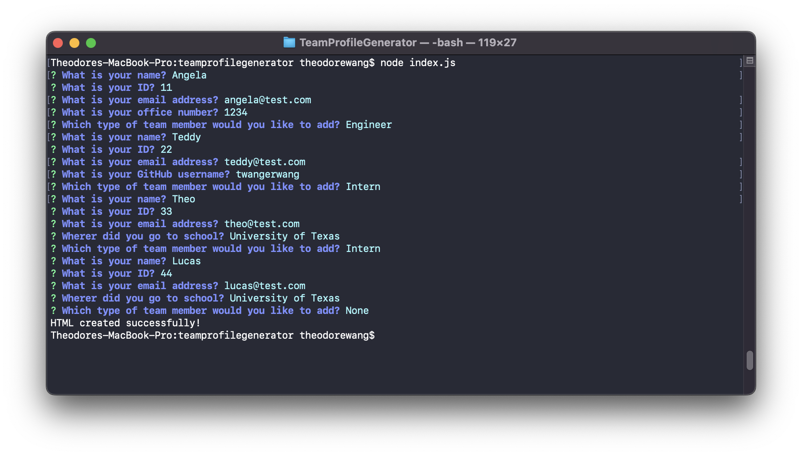
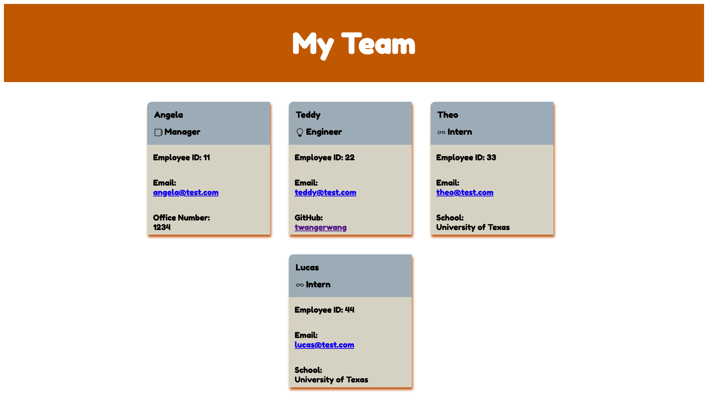
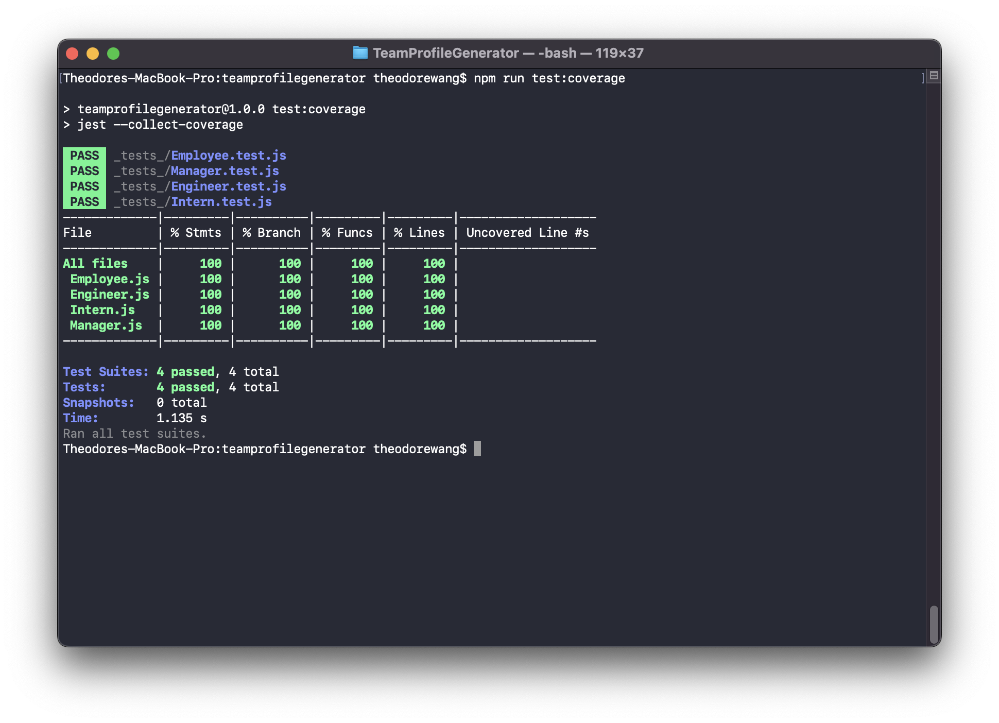

# TeamProfileGenerator

Create a team generator where a team consists of a Manager and any number of Engineers and Interns. The generator then exports the team onto an HTML page. 

## Description
* Upon initializing index.js, the user is presented with questions about what role the team member plays and infor about that team member. 

* All employees will have name, ID, email. Only the Manager will have an office number. Only the Engineer will have a GitHub useername. Only the Intern will have a school. 

## Mock-up
The images below shows the webpage created

## Location
Video link for demonstration: https://watch.screencastify.com/v/JFl6uviD28PD4Jbj7MsY

## Credits

## License
MIT License

Copyright (c) 2022 Teddy Wang

Permission is hereby granted, free of charge, to any person obtaining a copy
of this software and associated documentation files (the "Software"), to deal
in the Software without restriction, including without limitation the rights
to use, copy, modify, merge, publish, distribute, sublicense, and/or sell
copies of the Software, and to permit persons to whom the Software is
furnished to do so, subject to the following conditions:

The above copyright notice and this permission notice shall be included in all
copies or substantial portions of the Software.

THE SOFTWARE IS PROVIDED "AS IS", WITHOUT WARRANTY OF ANY KIND, EXPRESS OR
IMPLIED, INCLUDING BUT NOT LIMITED TO THE WARRANTIES OF MERCHANTABILITY,
FITNESS FOR A PARTICULAR PURPOSE AND NONINFRINGEMENT. IN NO EVENT SHALL THE
AUTHORS OR COPYRIGHT HOLDERS BE LIABLE FOR ANY CLAIM, DAMAGES OR OTHER
LIABILITY, WHETHER IN AN ACTION OF CONTRACT, TORT OR OTHERWISE, ARISING FROM,
OUT OF OR IN CONNECTION WITH THE SOFTWARE OR THE USE OR OTHER DEALINGS IN THE
SOFTWARE.